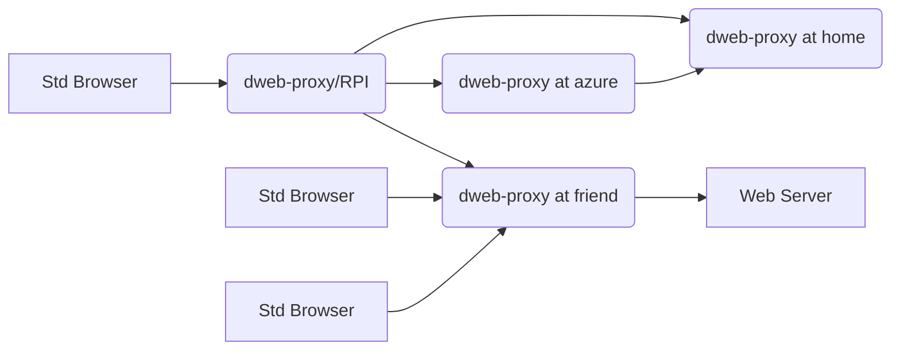
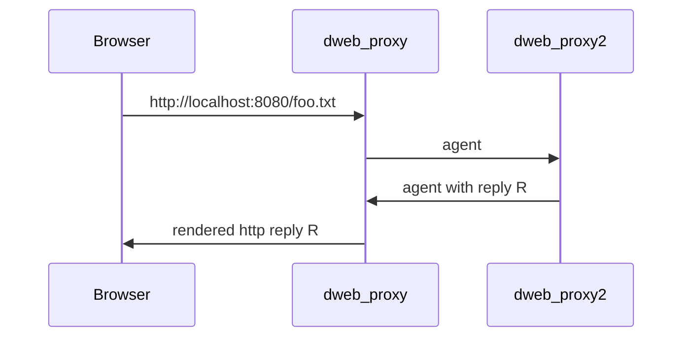
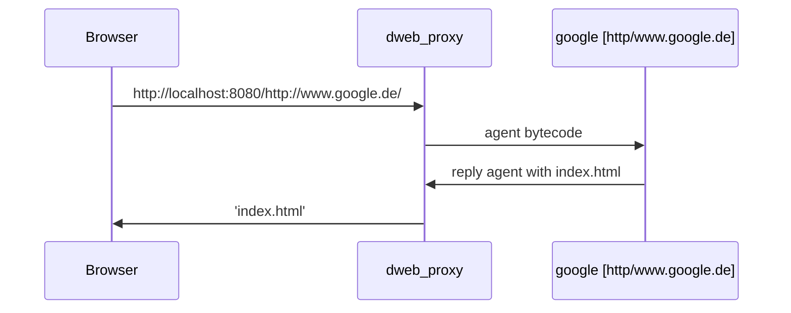

Proxy to a distributed web.
===========================


# What is this?

A distributed we allows mesh-networking to access the network.

The mesh is a graph of connected nodes.
Nodes can be anywhere in the internet.




dweb_proxy instances try to auto-configure as much as possible

dweb_proxy:
- instances try to automatically find each other in LANs using zeroconf (Avahi)
- instances try to find direct connections as much as possible
- when no local connection is found, try a set of 
builtin contact points
- a configuration file lists contact points
- a cweb_proxy instance can itself forward traffic to a normal web-browser

Agent support:
- agents can traverse the web to locate items
- agents are small programs running in a sandbox
- items can be made visible to the sandbox for agents to find them
- agents are async, they are sent back with reply payloads

Traffic flow for dweb-content:


Agent contains 'search foo.txt' bytecode cmd.
Reply agent contains content of foo.txt's data
with one bytecode 'payload' with foo.txt content.
The 'payload' bytecode consists of:
- opcode
- length in bytes
- the payload's bytes


Traffic flow for http tunneling:


- Each agent contains an ID
- Agent here contains just 'wget' bytecode cmd.
- Reply agent must contain same agent-ID
- To avoid loops, agents have a TTL
- To avoid loops, agents contains a path
- dbus_proxy's have a unique ID (based on machine's MAC address of primary interface) 
- agents are written in BSON (binary json) format (https://json.nlohmann.me/features/binary_formats/bson/)


# How to Install

```bash
sudo apt-get install libboost-all-dev
sudo apt-get install libssl-dev


mkdir build
cd build
cmake ..
cmake --build .
cmake --install .
```

